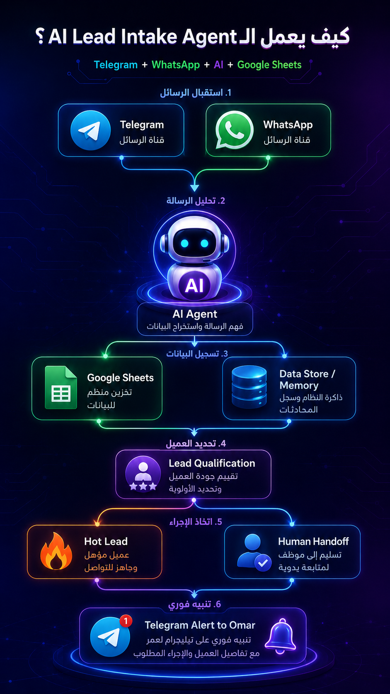
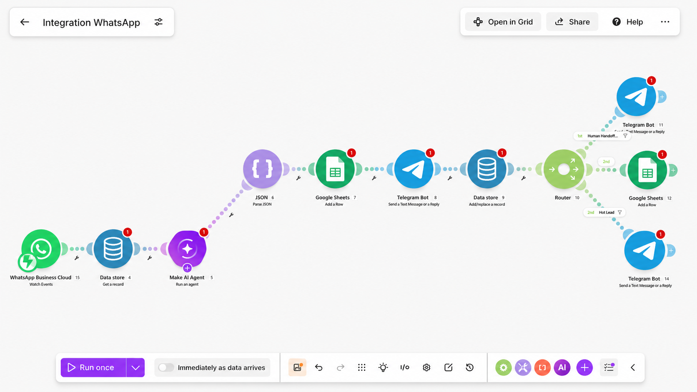
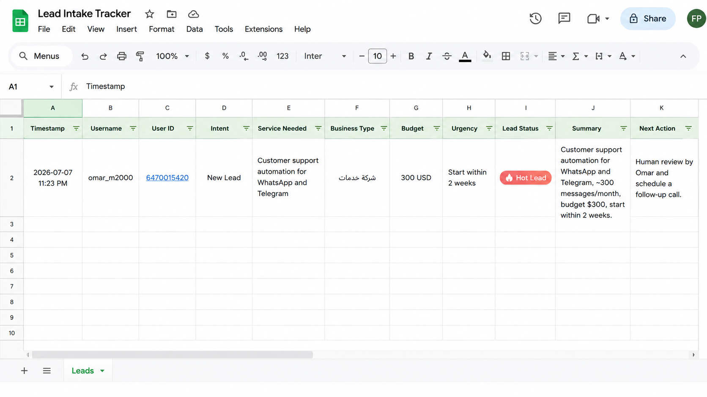
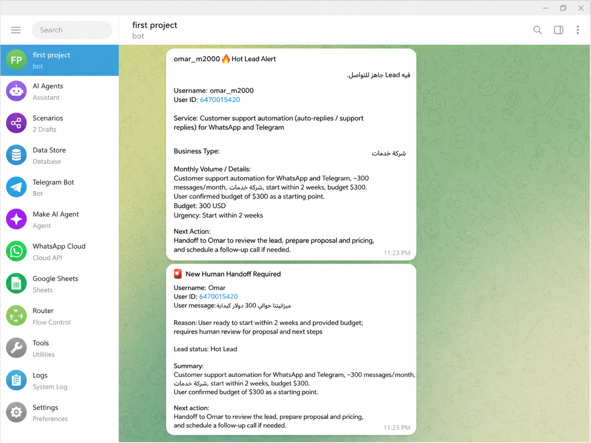
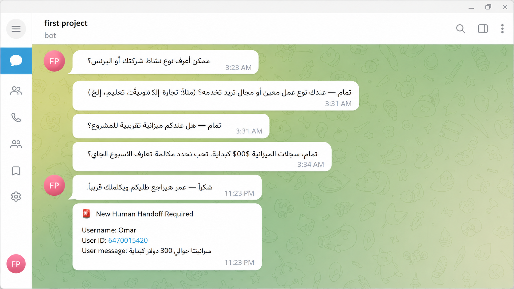

# AI WhatsApp & Telegram Lead Intake Agent

An AI-powered lead intake automation system built with Make.com.

This project helps businesses manage incoming customer messages, qualify leads automatically, store lead data, remember conversation context, and notify the business owner when a lead is ready for follow-up.

## Project Overview
## Project Screenshots

### Project Cover

### Workflow Architecture

### Telegram Workflow

### WhatsApp Business Cloud Structure

### Lead Tracker in Google Sheets

### Telegram Lead Conversation

### Hot Lead Alert

The system receives customer messages, analyzes them using a Make AI Agent, asks smart follow-up questions, saves structured lead data into Google Sheets, updates conversation memory, and sends instant alerts when a lead becomes a Hot Lead.

The workflow is demonstrated using Telegram and is structured to support WhatsApp Business Cloud when a business phone number is available.

## Tools Used

- Make.com
- Make AI Agent
- Telegram Bot
- WhatsApp Business Cloud structure
- Google Sheets
- Data Store
- JSON Parser
- Router
- Hot Lead Alerts

## Workflow

1. Customer sends a message through Telegram
2. The system checks previous conversation memory
3. Make AI Agent analyzes the message
4. JSON Parser extracts structured lead data
5. Google Sheets stores the lead details
6. Telegram Bot replies to the customer
7. Data Store updates conversation memory
8. Router checks lead status
9. Hot Lead Alert is sent to the business owner
10. Human Handoff is triggered when needed

## Key Features

- AI lead qualification
- Conversation memory
- Smart follow-up questions
- Google Sheets lead tracking
- Hot Lead detection
- Human handoff routing
- Telegram customer replies
- WhatsApp Business Cloud-ready structure

## Example Use Case

A customer asks for customer support automation.

The AI Agent collects:
- Service needed
- Support channels
- Monthly message volume
- Business type
- Budget
- Urgency

When the customer provides budget and timeline, the system sends a Hot Lead Alert to Omar with all lead details and the recommended next action.

## Business Value

This automation helps businesses reduce manual message handling, identify serious leads faster, and organize customer data in one place.

## Future Improvements

- Full WhatsApp Business Cloud deployment
- Calendar booking automation
- CRM integration
- Payment link automation
- Voice message analysis
- Multi-language support

## Project Status

Working Telegram demo completed.
WhatsApp Business Cloud integration structure prepared.
